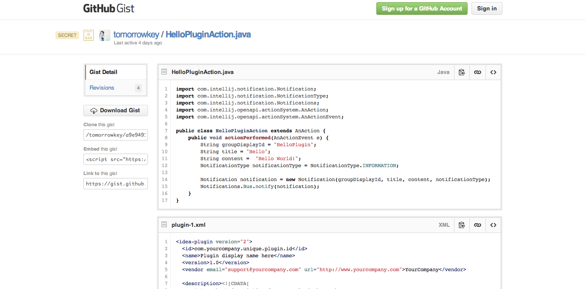
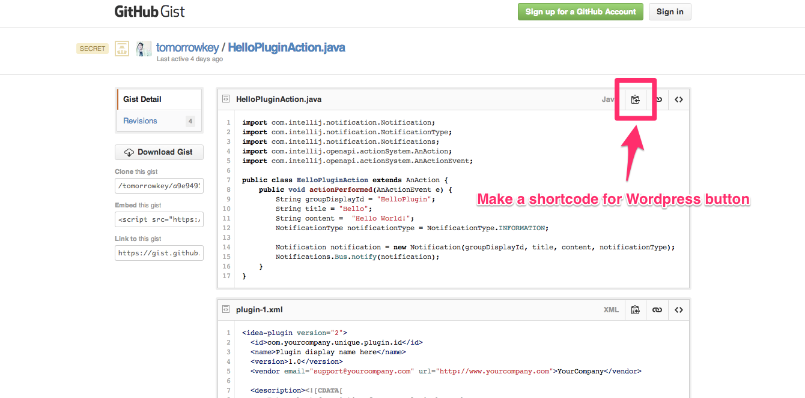
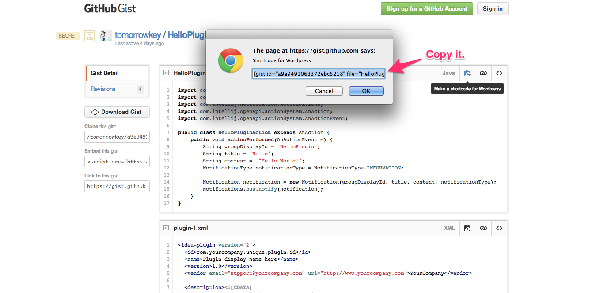

# Make a Gist shortcode for Wordpress

You will be able to make a shortcode of plugins for Wordpress of embedding Gist.  
The plugins for wordpress of embedding Gist is like [like this](http://wordpress.org/plugins/embed-github-gist/).

## Usage

### Install

Download the extension from Chrome Web Store and install.

### Visit Gist



Vist any Gist page.

### Click a button.



Click "Make a shortcode for Wordpress" button.

### Copy



The shortcode will be appeared on prompt.  
Just copy it.

## ToDo

* Change to copy the shortcode automatically.

## License
```
Copyright 2014 tomorrowkey

Licensed under the Apache License, Version 2.0 (the "License");
you may not use this file except in compliance with the License.
You may obtain a copy of the License at

http://www.apache.org/licenses/LICENSE-2.0

Unless required by applicable law or agreed to in writing, software
distributed under the License is distributed on an "AS IS" BASIS,
WITHOUT WARRANTIES OR CONDITIONS OF ANY KIND, either express or implied.
See the License for the specific language governing permissions and
limitations under the License.
```

